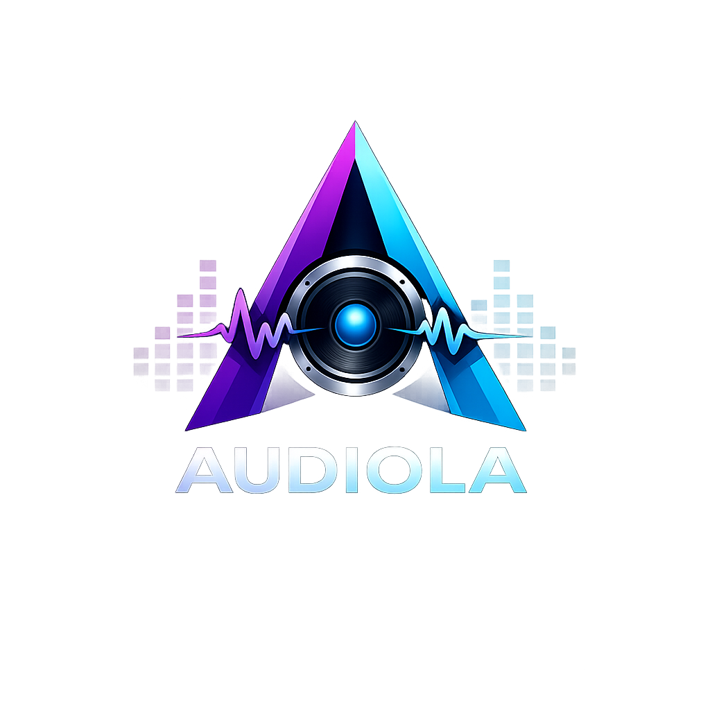
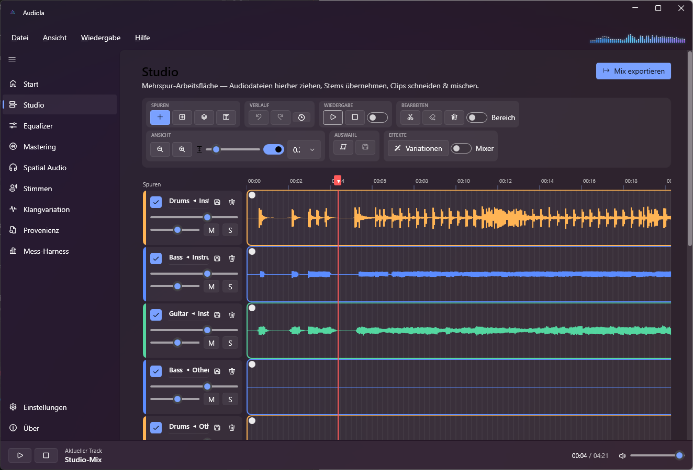
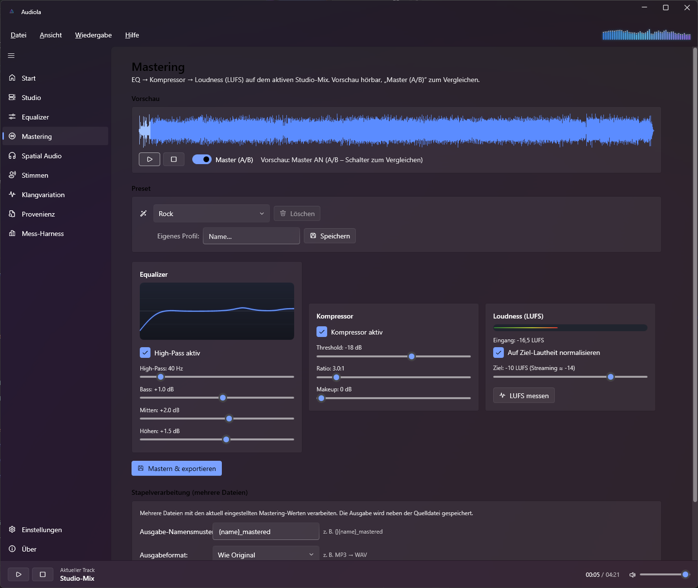
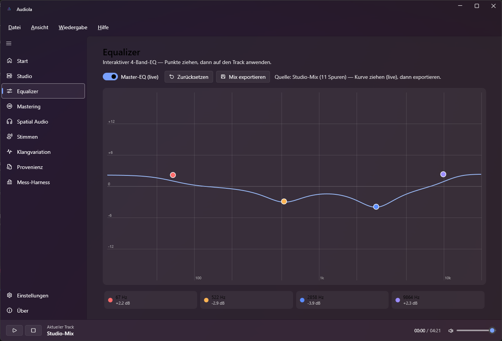
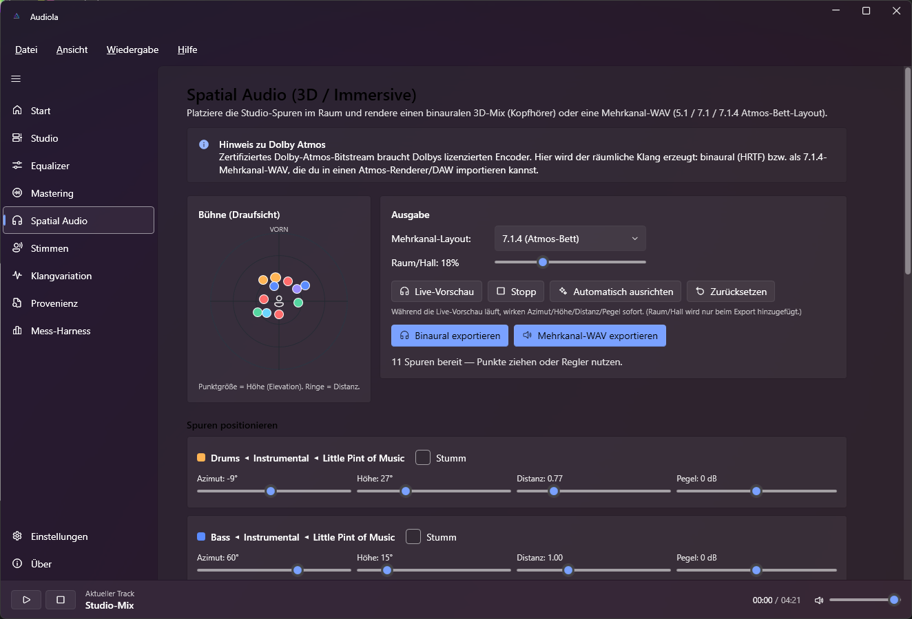
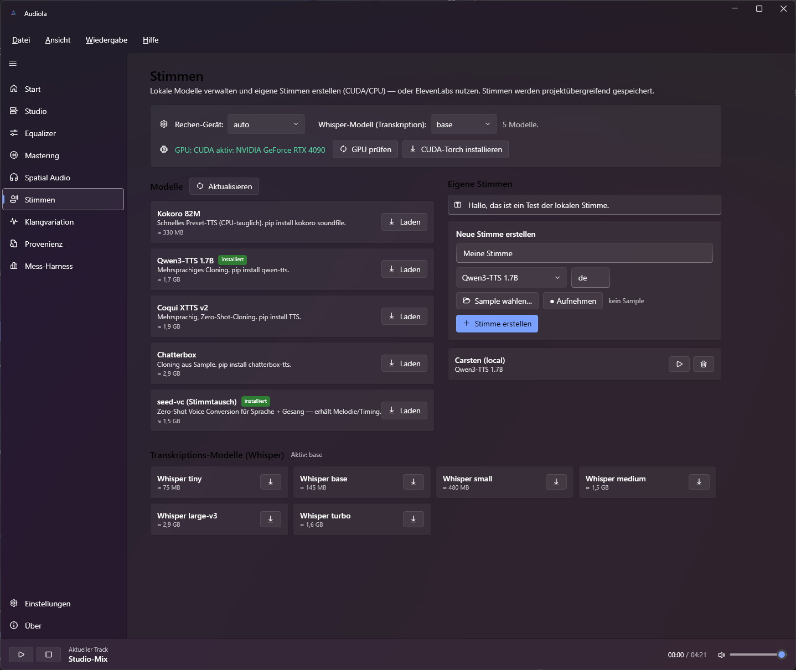
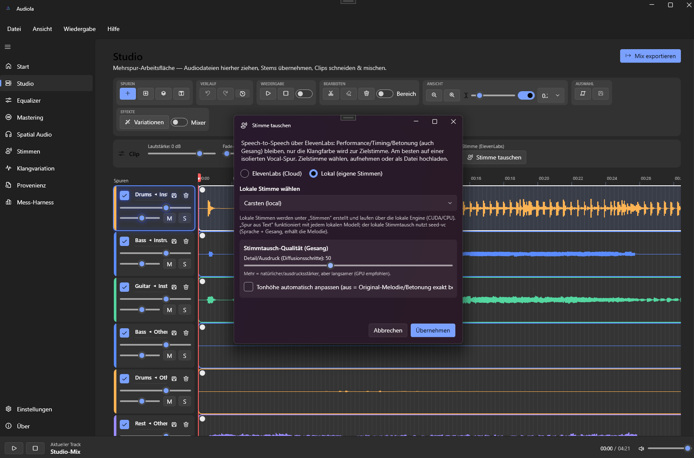
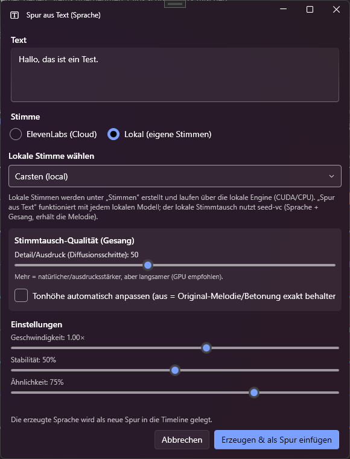

<div align="center">



# Audiola

### A modern Windows audio studio — arrange, separate, remix, master and master in 3D.

A full audio-production studio for Windows built on **.NET 10 + WPF (Fluent / WPF-UI)**, with a companion **.NET 10 Blazor WebAssembly** web app. Drag a song in, split it into stems, edit on a multitrack timeline, swap or synthesize voices with local AI, master to broadcast loudness and export an immersive 3D mix — all in one app that provisions everything it needs.

<br/>

[](https://github.com/fgilde/Audiola/releases/latest/download/Audiola-win-Setup.exe)
&nbsp;
[](https://fgilde.github.io/Audiola/)

<br/>

[](https://dotnet.microsoft.com/)
[](https://github.com/fgilde/Audiola/releases/latest)
[-5B8CFF)](https://github.com/lepoco/wpfui)
[](https://velopack.io)
[](https://github.com/fgilde/Audiola/actions)
[](#license)

</div>

---

## Table of contents

- [What is Audiola?](#what-is-audiola)
- [Feature overview](#feature-overview)
- [Screenshots](#screenshots)
- [Features in depth](#features-in-depth)
  - [Studio — multitrack timeline](#-studio--multitrack-timeline)
  - [Stem separation](#-stem-separation)
  - [Track editor](#-track-editor)
  - [Equalizer](#-equalizer)
  - [Mastering](#-mastering)
  - [Spatial Audio (3D / immersive)](#-spatial-audio-3d--immersive)
  - [Voices — local & cloud TTS and voice swap](#-voices--local--cloud-tts-and-voice-swap)
  - [Transcription & lyrics](#-transcription--lyrics)
  - [Provenance analysis](#-provenance-analysis)
  - [Project format, undo & export](#-project-format-undo--export)
- [Requirements](#requirements)
- [Install](#install)
- [Self-provisioning & GPU / CUDA](#self-provisioning--gpu--cuda)
- [Build & run from source](#build--run-from-source)
- [Web version](#web-version)
- [Tech stack](#tech-stack)
- [Releasing](#releasing)
- [Documentation site](#documentation-site)
- [License](#license)

---

## What is Audiola?

Audiola is a desktop audio studio that brings the heavy parts of modern music production into one Fluent-design app: a multitrack timeline, AI stem separation, a focused waveform editor, an interactive equalizer, broadcast-grade mastering, immersive 3D / spatial-audio rendering and a full local + cloud voice toolkit (text-to-speech and voice swapping).

It is **self-provisioning** — the AI/ML features run through a managed Python environment that the app sets up, populates and updates for you. There is no manual `pip install` to run; click a button and Audiola downloads the model it needs into its own isolated environment.

Audiola ships as a Windows desktop app and is accompanied by a Blazor WebAssembly web companion.

---

## Feature overview

| | Area | What it does |
|---|---|---|
| 🎛️ | **Studio** | Multitrack timeline: drag clips in, cut/trim, per-clip volume/pan/mute/solo, fades, snapping, zoom, per-track colors, real-time spectrum, one-click Export Mix. |
| 🧩 | **Stem separation** | Demucs (`htdemucs` / `htdemucs_ft` / `htdemucs_6s` / `mdx`) and high-quality separation via audio-separator (BS-RoFormer, Mel-Band RoFormer karaoke, 6-stem Demucs). |
| ✂️ | **Track editor** | Focused waveform editor: trim, delete, silence, fade in/out, normalize, echo, reverb, stereo widen, reverse, vocal cleanup, live FX preview, undo. |
| 🎚️ | **Equalizer** | Interactive 4-band EQ with a live Master-EQ on the studio mix. |
| 🏆 | **Mastering** | EQ → compressor → loudness (LUFS / BS.1770 / EBU R128) chain, A/B preview, genre presets, custom profiles and batch processing. |
| 🌐 | **Spatial Audio** | Position tracks in 3D, render binaural (HRTF) for headphones, or multichannel WAV (5.1 / 7.1 / 7.1.4 Atmos bed). |
| 🗣️ | **Voices** | Local AI models (Kokoro, Qwen3-TTS, XTTS v2, Chatterbox, seed-vc) + ElevenLabs. Create voices, swap a clip's voice, add a track from text. |
| 📝 | **Transcription** | Whisper transcription → LRC lyrics + embedded lyrics tag. |
| 🔎 | **Provenance** | Read-only C2PA / metadata / AI-generation marker analysis. |
| 💾 | **Project & export** | Native `.audiola` project bundle, full undo/redo with visual history, export to WAV / MP3 / AAC-M4A. |

---

## Screenshots

> The app uses a dark Fluent (Mica) theme with a frequency-gradient accent and a real-time spectrum visualizer.

<div align="center">

### Studio — the multitrack workspace



</div>

<table>
  <tr>
    <td align="center" width="50%"><b>Mastering</b><br/></td>
    <td align="center" width="50%"><b>Interactive Equalizer</b><br/></td>
  </tr>
  <tr>
    <td align="center"><b>Spatial Audio (3D / immersive)</b><br/></td>
    <td align="center"><b>Voices — local &amp; cloud</b><br/></td>
  </tr>
  <tr>
    <td align="center"><b>Swap a clip's voice</b><br/></td>
    <td align="center"><b>Add a track from text (TTS)</b><br/></td>
  </tr>
</table>

<sub>All screenshots live in <code>assets/screenshots/</code> and are also shown on the <a href="https://fgilde.github.io/Audiola/">documentation site</a>.</sub>

---

## Features in depth

### 🎛️ Studio — multitrack timeline

A timeline workspace where the whole mix comes together.

- **Drag audio files straight onto the timeline** (WAV, MP3, FLAC, AIFF, M4A, OGG) and arrange clips across as many tracks as you like.
- **Clip editing:** split at the playhead, trim either edge with snapping, cut a region out, delete, and drag clips freely between tracks.
- **Per-clip controls:** gain (−24…+6 dB) and independent fade-in / fade-out handles drawn right on the clip.
- **Per-track controls:** volume, pan, mute, solo, enable, inline rename, **custom accent color** from an 8-color palette, and one-click **duplicate track**.
- **Timeline tools:** zoom (10–200 px/s), adjustable lane height (80–320 px), a snapping grid (0.1 / 0.25 / 0.5 / 1.0 s), a **draggable playhead with auto-scroll**, and a global selection range with loop playback.
- **Real-time spectrum visualizer** (audioMotion-style) right in the timeline header.
- **Master mix:** master volume plus a live Master-EQ, and a one-click **Export Mix** that renders every track with its effects.

### 🧩 Stem separation

Pull a song apart into its instruments — added straight back onto the timeline as new tracks.

- **Demucs** (local, via Python): `htdemucs`, `htdemucs_ft` (fine-tuned, the default), `htdemucs_6s` (6-stem) and the `mdx_extra` / `mdx_extra_q` models. Optional test-time augmentation (`shifts`) trades speed for quality.
- **High-quality separation via `audio-separator`:**
  - **BS-RoFormer** — state-of-the-art vocals / instrumental.
  - **Mel-Band RoFormer (karaoke)** — separates lead from background vocals.
  - **Demucs 6-stem** — vocals, drums, bass, guitar, piano, other.
- **Stems extracted:** vocals, drums, bass, guitar, piano and other.
- **Smart / auto mode** runs a 6-stem split with content detection, automatically dropping near-silent stems below a sensible threshold.

### ✂️ Track editor

Double-click a clip to open a focused, large waveform editor with non-destructive edits and live preview.

- **Edits:** trim to selection, delete (close the gap), silence a selection, linear fade-in / fade-out.
- **Effects:** normalize, **echo** (delay + feedback + mix), **reverb** (Schroeder reverberator), **stereo widen** (mid/side), **reverse**, and a one-click **vocal cleanup** (high-pass, harshness taming, air shelf, de-esser and gentle compression).
- **Live FX preview** for echo, reverb and stereo widen with real-time parameter changes during playback.
- **Undo** and per-edit export to WAV / MP3 / M4A.

### 🎚️ Equalizer

- Interactive **4-band EQ** — low-shelf @ 100 Hz, peaking @ 500 Hz, peaking @ 3 kHz, high-shelf @ 10 kHz — with draggable curve points.
- A **live Master-EQ** applied to the studio mix while you listen.
- Export the EQ-processed mix or a single loaded track.

### 🏆 Mastering

A professional mastering chain on your studio mix.

- **Chain:** EQ (high-pass + low shelf + peaking mid + high shelf) → **compressor** (stereo-coupled, feed-forward) → **loudness** normalization.
- **Loudness metering** uses ITU-R **BS.1770** / **EBU R128** integrated **LUFS**, with K-weighting and gating.
- **A/B preview** between the original and mastered signal, with a live master processor.
- **Genre presets** — Streaming −14 LUFS, Pop, Rock, Radio-Ready, Loud/Club, Warm/Vintage, Podcast, Bass-Boost, HipHop/Trap, EDM, Acoustic/Folk, Lo-Fi, Vocal-Boost — plus your own **savable custom profiles**.
- **Target-loudness normalization** to a LUFS target of your choice.
- **Batch / bulk mastering:** master many files at once with an output-filename template and **format conversion** (e.g. convert MP3 → WAV), with per-file progress.

### 🌐 Spatial Audio (3D / immersive)

Place your studio tracks in 3D space and render an immersive mix.

- **Position each source** by **azimuth, elevation, distance and level**, with a top-down radar you can drag.
- **Auto-arrange** intelligently places common track types (vocals center, bass center, drums front, guitar/piano to the sides, etc.).
- **Live preview** of the spatial mix while you adjust.
- **Binaural (HRTF) export** for headphones — ITD/ILD, head-shadow filtering and optional room reverb.
- **Multichannel WAV export:** **5.1**, **7.1** and **7.1.4** (Atmos bed) layouts written as `WAVE_FORMAT_EXTENSIBLE` with the correct channel masks.

> **Note:** Audiola is **not** a licensed Dolby Atmos bitstream encoder. It produces spatial audio — binaural stereo or a 7.1.4 multichannel WAV — that you can import into an Atmos renderer or DAW for certified encoding.

### 🗣️ Voices — local & cloud TTS and voice swap

A complete voice toolkit, with local AI models that the app downloads and runs for you.

- **Local models** (managed Python environment, one-click download):
  - **Kokoro** — fast, CPU-friendly preset TTS.
  - **Qwen3-TTS** — multilingual TTS with zero-shot voice cloning.
  - **Coqui XTTS v2** — multilingual TTS with zero-shot cloning.
  - **Chatterbox** — TTS with voice cloning from a sample.
  - **seed-vc** — zero-shot **voice conversion** (speech-to-speech) that preserves melody, timing and emphasis — it works for **singing**, not just speech.
- **Create your own voices** by recording from your microphone or uploading a sample.
- **Swap the voice of a clip** locally with seed-vc (keeps the performance/timing, changes only the timbre) or via **ElevenLabs** speech-to-speech.
- **Add a new track from text** (TTS) using the same voice picker, with speed and (for ElevenLabs) stability/similarity controls.
- **Device selection** (`auto` / `cuda` / `cpu` / `directml`) with a visible **GPU check** and a one-click **Install CUDA Torch** button.

### 📝 Transcription & lyrics

- **Whisper** transcription with selectable model sizes: `tiny`, `base`, `small`, `medium`, `large-v3` and `turbo`.
- Produces **LRC** time-synced lyrics and can **embed a lyrics metadata tag** into exported tracks.

### 🔎 Provenance analysis

- A **read-only** analyzer that scans an audio file for **C2PA** content credentials, **IPTC** AI-generation markers, **XMP**/ID3 metadata and generator tags.
- Optionally reads a full C2PA manifest via `c2patool` if installed.
- Explains how multi-layer detection works (metadata, watermark, ML classifier). It only reports — it makes no changes to your audio.

### 💾 Project format, undo & export

- **Native `.audiola` project** — a single archive bundling the manifest plus all media, so clips, fades, gains, track colors, EQ bands, mastering settings, spatial layout and lyrics are all preserved (no stem re-extraction needed).
- **Full undo/redo** with a **visual history** you can click to jump to any earlier state.
- **Export** the full mix, a selection range or an individual track to **WAV**, **MP3** or **AAC-M4A**.

---

## Requirements

- **Windows 10 / 11 (x64).**
- **Running the installer:** nothing else — the released build is self-contained.
- **AI/ML features** (stem separation, local voices, transcription): a **Python** interpreter on your system that Audiola can use as the base for its managed environment. Everything else (model downloads, dependency installs) is handled in-app.
- **Optional NVIDIA GPU + CUDA** for dramatically faster stem separation, voice conversion and transcription.
- **Optional ElevenLabs API key** for cloud speech-to-speech / TTS.

---

## Install

Download the latest **`Audiola-win-Setup.exe`** from the [**Releases**](https://github.com/fgilde/Audiola/releases/latest) page and run it.

Audiola **updates itself automatically** on launch, powered by [Velopack](https://velopack.io).

---

## Self-provisioning & GPU / CUDA

Audiola sets up everything its AI features need — **no manual `pip install` required.**

- A **managed, isolated Python virtual environment** is created under your local app data from the base Python you point it at in **Settings**.
- Each model is downloaded **on demand with one click** (Demucs, audio-separator, faster-whisper, the local voice models, seed-vc, etc.), installed into that managed environment.
- In the **Voices** page you can pick the compute device (`auto` / `cuda` / `cpu` / `directml`), run a **GPU check** to see whether CUDA is active and which GPU is detected, and click **Install CUDA Torch** to install a matching CUDA build of PyTorch for GPU acceleration.

If you'd rather wire up Python yourself, point Audiola's Python path at any interpreter (`python`, `py`, or a venv path) in **Settings**.

---

## Build & run from source

Requires the **.NET 10 SDK** on Windows.

```powershell
# Clone
git clone https://github.com/fgilde/Audiola.git
cd Audiola

# Run the WPF desktop app
dotnet run --project src/Audiola/Audiola.csproj
```

Build the whole solution:

```powershell
dotnet build Audiola.sln -c Release
```

### Solution layout

| Project | Target | Purpose |
|---|---|---|
| `src/Audiola/Audiola.csproj` | `net10.0-windows` | The WPF desktop studio app (entry point). |
| `src/Audiola.Core/Audiola.Core.csproj` | `net10.0-windows` | Shared DSP, mastering, stem separation, voices, project format. |
| `src/Audiola.Web/Audiola.Web.csproj` | `net10.0` | Blazor WebAssembly web companion. |
| `src/Audiola.Api/Audiola.Api.csproj` | `net10.0-windows` | API that hosts the WASM client (same origin). |
| `src/Audiola.AppHost/Audiola.AppHost.csproj` | `net10.0` | .NET Aspire app host for the web stack. |

---

## Web version

A **.NET 10 Blazor WebAssembly** companion (`src/Audiola.Web`) is hosted by `src/Audiola.Api`, orchestrated for local development by the **.NET Aspire** app host (`src/Audiola.AppHost`).

> 🔗 **Open Web version:** _hosting URL coming soon._ <!-- TODO: replace with the deployed web app URL -->

---

## Tech stack

**.NET 10** · **WPF** · [**WPF-UI**](https://github.com/lepoco/wpfui) (Fluent / Mica) · [**NAudio**](https://github.com/naudio/NAudio) + NAudio.Lame · SoundTouch · [**CommunityToolkit.Mvvm**](https://github.com/CommunityToolkit/dotnet) · [**TagLibSharp**](https://github.com/mono/taglib-sharp) · [**Velopack**](https://velopack.io) (auto-update) · **.NET 10 Blazor WebAssembly** + [**.NET Aspire**](https://learn.microsoft.com/dotnet/aspire/) · [**MudBlazor.Extensions**](https://github.com/fgilde/MudBlazor.Extensions) · [AuralizeBlazor](https://github.com/fgilde/AuralizeBlazor).

Python sidecars power the AI/ML parts: [**Demucs**](https://github.com/facebookresearch/demucs), [**audio-separator**](https://github.com/nomadkaraoke/python-audio-separator), [**faster-whisper**](https://github.com/SYSTRAN/faster-whisper), [**seed-vc**](https://github.com/Plachtaa/seed-vc), Kokoro, Qwen3-TTS, Coqui XTTS v2 and Chatterbox.

---

## Releasing

Pushing a `v*.*.*` tag triggers the GitHub Actions workflow (`.github/workflows/release.yml`), which publishes the app, builds the **Velopack** installer and attaches it (plus the update feed) to a GitHub release:

```powershell
git tag v0.1.0
git push origin v0.1.0
```

---

## Documentation site

The full marketing & documentation site lives in [`docs/`](docs/) and is published with **GitHub Pages**:

➡️ **https://fgilde.github.io/Audiola/**

---

## License

© Florian Gilde. All rights reserved.

This project is currently distributed without an open-source license; please see the [repository](https://github.com/fgilde/Audiola) or contact the author for usage terms.
